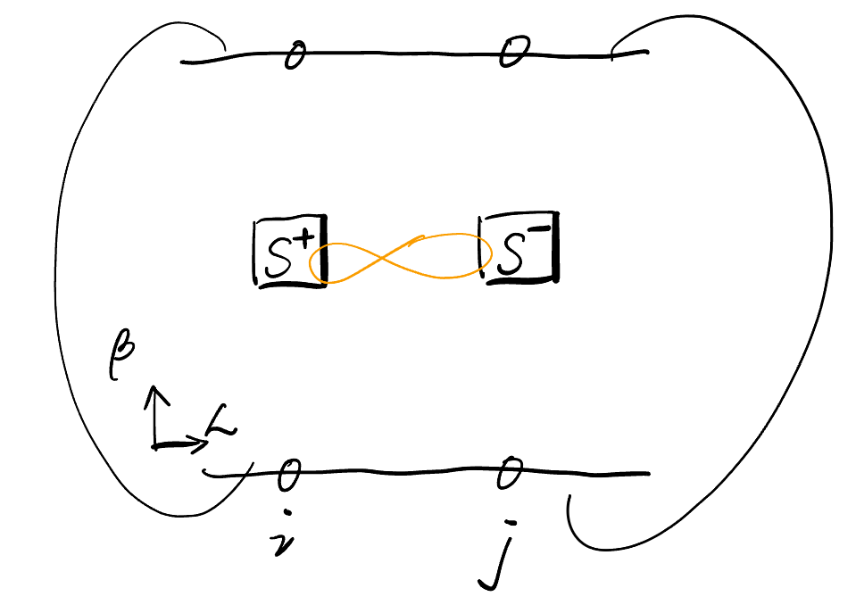
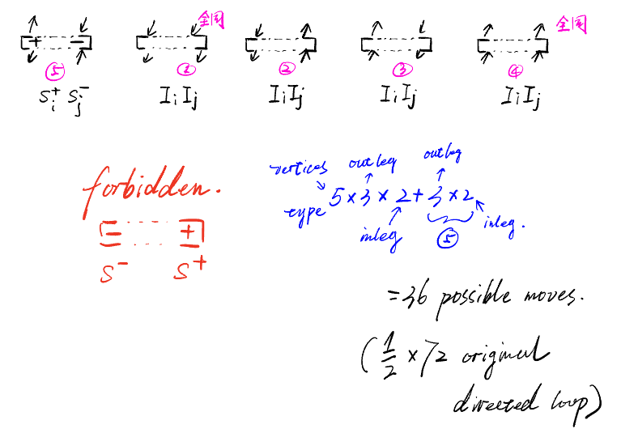

# Measuring the Rényi-1 Correlator in SSE-QMC: Basic Idea, Method, and Results

## Introduction

Strong-to-weak spontaneous symmetry breaking (SWSSB) extends the notion of symmetry breaking to mixed quantum states, where **strong** and weak symmetries can behave differently [@Lessa2025Strong] [@Wang2026Strong]. A useful diagnostic is the Rényi-1 correlator introduced by Weinstein [@Weinstein2025Efficient]. For a density matrix $\rho$ (mixed state) and a charged operator $O_{ij}=O_iO_j^\dagger$, the Rényi-1 correlator, or $R_1$, is defined as

$$
R_1(i,j)=\operatorname{Tr}\!\left[O_{ij}\sqrt{\rho}\,O_{ij}^{\dagger}\sqrt{\rho}\right].
$$

This quantity describes how distinguishable the perturbed mixed state $O_{ij}\sqrt{\rho}\,O_{ij}^{\dagger}$ is from the original state. Together with the conventional two-point correlation function, typically defined as $C(i,j)=\operatorname{Tr}\!\left[\rho O_{ij}\right]$, the thermodynamic behavior of these two order parameters can identify a special phase in which the strong symmetry is broken while the weak symmetry remains unbroken. Numerically, exact diagonalization (ED) and tensor-network methods can evaluate these quantities, but their accessible system sizes and dimensions are limited. Here, we use stochastic series expansion (SSE) quantum Monte Carlo (QMC) to explore the Rényi-1 correlator in larger systems and to study its thermodynamic behavior in higher dimensions. SSE-QMC is a widely used QMC method that efficiently simulates the partition function of quantum systems through an **Boltzmann factor** or imaginary-time Taylor expansion, and is particularly well suited to equilibrium spin systems [@Sandvik2010Computational].

Recently, we introduced the generalized reduced-density-matrix (GRDM) framework to expand the range of observables that can be measured directly in QMC [@Wang2026Generalized]. One direct application is the calculation of $R_1$ in SSE-QMC. In this blog, I will introduce the basic idea of how the Rényi-1 correlator appears in SSE and explain how GRDM can be used to measure it. I will also provide an additional perspective and an exploratory variant of the method, which is not necessarily the same as the procedure described in the paper.   Further technical details are available in our paper, [arXiv:2603.10948](https://arxiv.org/abs/2603.10948). I hope this blog will help broaden the QMC community’s understanding of Rényi-1 measurements and contribute to further studies of SWSSB. I also welcome discussion and collaboration on these ideas.

## Method

At first sight, the definition of the Rényi-1 correlator seems to suggest a straightforward numerical route: construct the full density matrix $\rho$, take its matrix square root, and then evaluate the trace in $R_1$.    However, there will be no advantage, because explicitly reconstructing $\rho$ already requires exponentially growing resources.

The useful simplification comes from the fact that we are interested in a thermal equilibrium state,
$$
\rho_\beta=\frac{e^{-\beta H}}{Z}
$$
Its square root is then known analytically,
$$
\sqrt{\rho_\beta}=\frac{e^{-\frac{1}{2}\beta H}}{\sqrt Z}.
$$
The factor $1/2$ can be viewed either as rescaling the Hamiltonian, $H\rightarrow H/2$,  or as halving the imaginary-time evolution, $\beta\rightarrow\beta/2$.

The paper chose the latter. Substituting this form into the definition gives
$$
R_1(i,j) = \frac{1}{Z} \operatorname{Tr} \left[ e^{-\beta H/2} O_{ij} e^{-\beta H/2} O_{ij}^{\dagger} \right] = \left\langle O_{ij}(\beta/2)O_{ij}^{\dagger}(0) \right\rangle_\beta .
$$
Since $O_{ij}=O_iO_j^\dagger$, this is explicitly a four-point imaginary-time correlation function,
$$
R_1(i,j)= \left\langle O_i(\beta/2)O_j^\dagger(\beta/2) O_j(0)O_i^\dagger(0) \right\rangle_\beta .
$$
Now it is GRDM's turn. GRDM: first RDM, then operator insertion. We first use the basic idea of an RDM measurement: for the sites involved in the observable, here $i$ and $j$, we open their imaginary-time boundaries, so that $i$ and $j$ have additional degrees of freedom. For the Rényi-1 correlator, we then place the paired operator $O_iO_j^\dagger$ at $\tau=\beta/2$.

Caption: A configuration with holes opened at sites $i$ and $j$, together with two operators inserted along the imaginary-time direction. Here, for a $U(1)$-symmetric model, we take $O_iO_j^\dagger=S_i^+S_j^-$. The yellow line indicates that the two operators form a single composite object and are updated together.

Updating this configuration includes the diagonal update and the loop update.

- **Diagonal update.** Since $O_iO_j^\dagger$ consists of additionally inserted operators, they do not participate in the diagonal update of the Hamiltonian. When the update reaches the insertion layer, the inserted operators are handled directly. For example, if $O_iO_j^\dagger=S_i^+S_j^-$, the corresponding spins are flipped according to the action of the operators.

- **Loop update.** We need to realize the collective update $O_iO_j^\dagger \leftrightarrow I_iI_j$,  while intermediate states such as $O_iI_j$ or other partially updated configurations are forbidden. This can be implemented naturally within the directed-loop framework.

Caption: Possible update processes for the $S_i^+S_j^-$ insertion. When the directed loop reaches the insertion layer, there are 36 possible paths. Since the opposite operator sector is forbidden, this is equivalent to solving roughly half of the original directed-loop equations. The update of the additionally inserted operators does not affect the update of the Hamiltonian operators in the bulk. In particular, for vertex types 1–4, forbidding one operator sector simply removes two possible entrance channels. The remaining possibilities can be listed directly.

During the simulation, the same Markov chain samples both the $O$-sector and the $I$-sector, which are accumulated as the frequencies of the GRDM and RDM sectors, respectively. The final estimator is obtained from their normalized weight ratio, together with the conjugate matrix element evaluated from the boundary states in post-processing,
$$
R_1(i,j) = \frac{\operatorname{Tr}_{ij} (\rho_{O_i,O_j} O_{ij}^{\dagger} )}{\operatorname{Tr}_{ij} \rho_{I_i,I_j}}
$$
Clearly, the imaginary-time information at $\beta/2$ has already been encoded in $\rho_{O_i,O_j}$.

One additional condition is to fixed charge sector for SWSSB, so that the density matrix itself carries a strong symmetry at the beginning.  Besides designing a sector-preserving update, we prefer another way to fix the sector: allow the simulation to update across all sectors, but during measurement retain only the effective counts corresponding to states in the target sector. This avoids possible ergodicity problems caused by explicitly restricting the updates.

We have mentioned that the factor $1/2$ can be placed either in $\beta$ or in $H$. The paper uses the first choice. Here we describe the second choice, which was also explored in this project with Codex.

In the SSE representation, the imaginary-time propagator is expanded as

$$
 e^{-\beta H}
 =\sum_{n=0}^{\infty}\frac{\beta^n}{n!}(-H)^n.
$$

Suppose that the Hamiltonian is decomposed into local SSE vertices with matrix elements $w_\nu$. If we replace $H$ by $H/2$, then **every nonidentity Hamiltonian vertex** is rescaled as $w_\nu\longrightarrow w_\nu/2$. A configuration with $n$ nonidentity vertices therefore acquires the relative weight

$$
W_{1/2}(\mathcal C_n)
=\left(\frac{1}{2}\right)^n W(\mathcal C_n).
$$

This is exactly the same factor obtained by replacing $\beta$ with $\beta/2$ while keeping $H$ unchanged. The important point is that the rescaling must be applied consistently to all Hamiltonian-vertex weights. The directed-loop structure itself does not need to be changed. The diagonal insertion and removal probabilities use the rescaled absolute weights, while the local loop-scattering probabilities depend on ratios of local weights and therefore remain self-consistent after the uniform rescaling.

In this half-$H$ manifold, the Monte Carlo ensemble is normalized as

$$
\sqrt{\rho_\beta}
\equiv
\frac{e^{-\beta H/2}}{Z(\beta/2)} =
\frac{\widetilde{\sqrt{\rho_\beta}}}
{\operatorname{Tr}\sqrt{\rho_\beta}}.
$$

Therefore, the simulation samples the trace-normalized square root of the density matrix.  We can also measure observables from an RDM in this $\sqrt\rho$ manifold by opening imaginary-time boundaries. The resulting two-site reduced operator is

$$
Q_{ij}=\operatorname{Tr}_{\overline{ij}}e^{-\beta H/2},
$$

and a local observable is obtained from

$$
\langle O_{ij}\rangle_{\sqrt\rho}
=\frac{\operatorname{Tr}_{ij}(Q_{ij}O_{ij})}
{\operatorname{Tr}_{ij}Q_{ij}}.
$$

This is different from first constructing the ordinary reduced density matrix of $\rho$ and then taking its square root. The order here is to take the square root of the full density matrix first and only then perform the partial trace.  A natural idea is to use this two-site reduced operator to construct the Rényi-1 correlator in post-processing. For example, one may try

$$
R_1 =\frac{\Tr_{i,j}[(\sqrt\rho)_{\text{RDM with i,j }} \otimes
 [O_{ij}](\sqrt\rho)_{\text{RDM with i,j }}
 [O^\dagger_{ij}]]}{\Tr_{i,j}[(\sqrt\rho)_{\text{RDM with i,j }} \otimes
 [I](\sqrt\rho)_{\text{RDM with i,j }} [I]]}
$$

However, it is not equal to the strict full-system Rényi-1 correlator. The reason is that the partial trace does not preserve matrix multiplication. In general,

$$
\left(\operatorname{Tr}_{\overline{ij}}Q\right)^2
\neq
\operatorname{Tr}_{\overline{ij}}(Q^2).
$$

To recover the strict Rényi-1 correlator, one must instead construct the object $\sqrt{\rho}\,O_{ij}\sqrt{\rho}$ while keeping the environment indices connected between the two half-propagators. This requires operator insertion together with a two-replica half-propagator manifold. In practice, this brings us back to the first scheme, in which the factor $1/2$ is placed in $\beta$.

Even so, the half-$H$ construction provides a general way to realize a trace-normalized $\sqrt\rho$ SSE manifold.

## Results and Conclusions

The scheme 1 benchmark can be found in our paper. Here, I present several results from scheme 2.

The first table compares ordinary observables measured in the half-$H$ SSE manifold with ED calculations performed using the explicitly constructed $\sqrt{\rho_\beta}$.

| $L$ | observable | SSE $\sqrt{\rho}$ | ED $\sqrt{\rho}$ | SSE−ED |
|---:|---|---:|---:|---:|
| 4 | $E/L$ | $-0.295258(848)$ | $-0.2947082913$ | $-0.65\sigma$ |
| 4 | $\langle S_i^zS_{i+1}^z\rangle$ | $-0.0872895(1115)$ | $-0.0873670534$ | $+0.70\sigma$ |
| 4 | $\langle M_z^2/L\rangle$ | $0.1004005(2014)$ | $0.1004357138$ | $-0.17\sigma$ |
| 4 | $\langle M_s^2/L\rangle$ | $0.4495585(2640)$ | $0.4499039275$ | $-1.31\sigma$ |
| 6 | $E/L$ | $-0.2686175(5256)$ | $-0.2687621422$ | $+0.28\sigma$ |
| 6 | $\langle S_i^zS_{i+1}^z\rangle$ | $-0.0818580(1511)$ | $-0.0816536848$ | $-1.35\sigma$ |
| 6 | $\langle M_z^2/L\rangle$ | $0.1064197(1398)$ | $0.1065369955$ | $-0.84\sigma$ |
| 6 | $\langle M_s^2/L\rangle$ | $0.4497043(10788)$ | $0.4494691735$ | $+0.22\sigma$ |

The $z$-score is defined as $z=\frac{\mathrm{SSE}-\mathrm{ED}}{\sigma_{\mathrm{SSE}}}$,where $\sigma_{\mathrm{SSE}}$ is the statistical uncertainty estimated from five independent bins. The first table shows that all eight bulk observables agree with the ED results within $1.35\sigma$.

The second table compares two-site correlators obtained from the open-boundary RDM with the corresponding ED results.

| $L$ | observable | SSE RDM | ED RDM | difference |
|---:|---|---:|---:|---:|
| 4 | $\langle S_i^zS_j^z\rangle_{\sqrt{\rho}}$ | $0.025465(442)$ | $0.0251698206$ | $0.67\sigma$ |
| 4 | $\langle S_i^+S_j^-\rangle_{\sqrt{\rho}}$ | $0.151651(583)$ | $0.1517588489$ | $-0.18\sigma$ |
| 6 | $\langle S_i^zS_j^z\rangle_{\sqrt{\rho}}$ | $-0.008431(329)$ | $-0.0081587194$ | $-0.83\sigma$ |
| 6 | $\langle S_i^+S_j^-\rangle_{\sqrt{\rho}}$ | $-0.071571(437)$ | $-0.0723657589$ | $1.82\sigma$ |

Both diagonal and off-diagonal two-site correlators agree with ED, with deviations no larger than $1.82\sigma$.

Overall, this blog has presented two complementary routes for measuring Rényi-1 correlators in SSE-QMC. The first route places the factor $1/2$ in the imaginary-time extent and uses GRDM operator insertion, as in the original paper. The second route, explored here, places the factor $1/2$ in the Hamiltonian weights and uses open imaginary-time boundaries to sample a trace-normalized $\sqrt{\rho}$ manifold.
