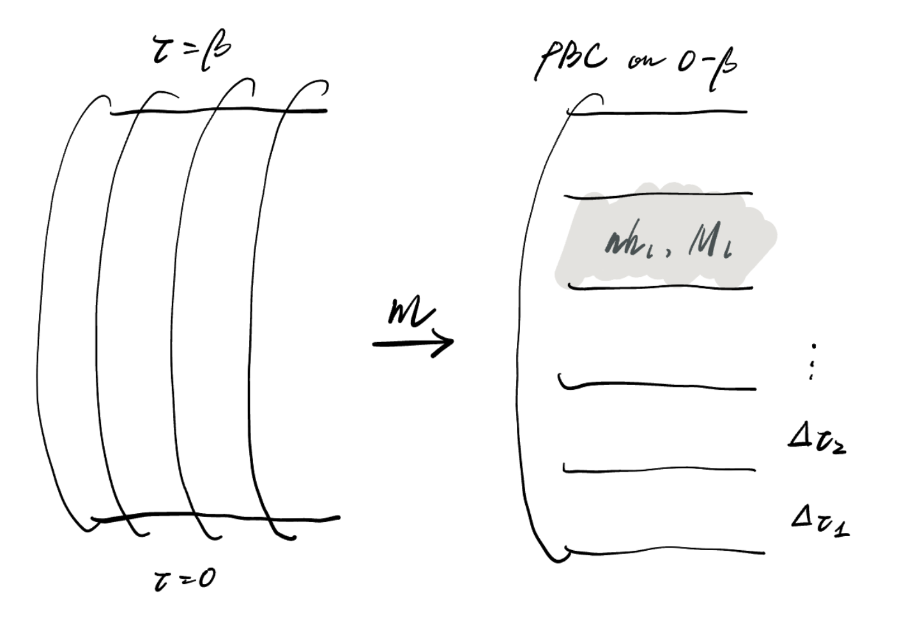
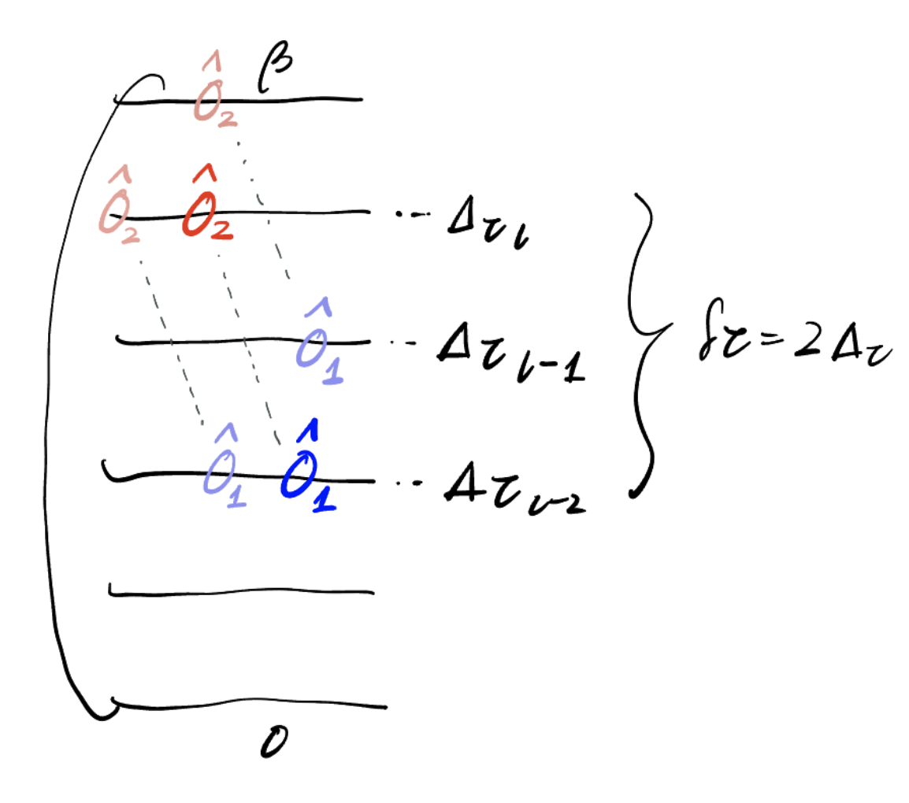
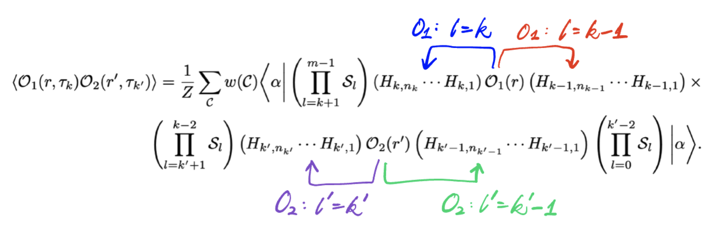
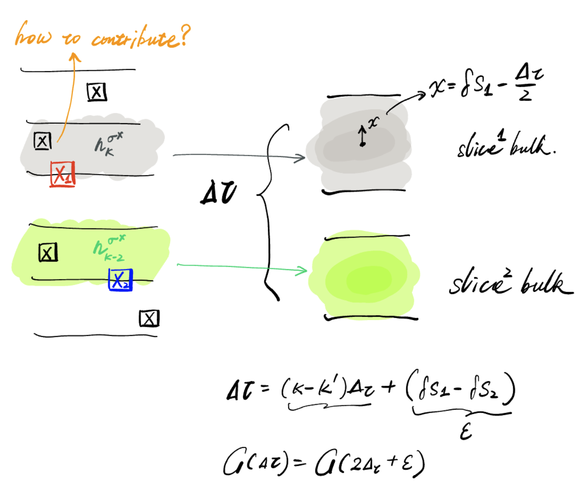
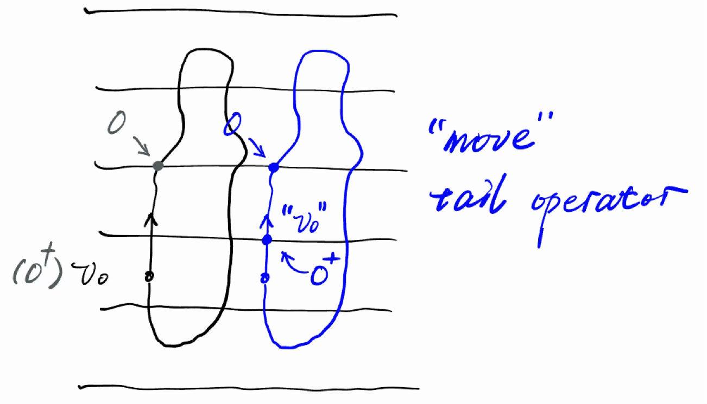

# Notes on Imaginary-Time Correlations in SSE-QMC: Basic Ideas and Measurement Techniques

This blog post follows [Flynn2026ImaginaryTime], a recent systematic guide on measuring imaginary-time correlation functions in Stochastic Series Expansion Quantum Monte Carlo (SSE-QMC).

A quick heads-up: this post is not meant for complete beginners--sorry about that! We won't be covering basic SSE setup here, and I'll assume you're already familiar with the foundational equations. Deriving everything from scratch would take up way too much space and distract from our main focus.

If you have any questions along the way, feel free to contact me.  Now enjoy!

We begin with the standard SSE partition function expansion:
$$
Z= \sum_{\mathcal C} \frac{\beta^n(M-n)!}{M!} \left\langle\alpha\left| \prod_{p=1}^{M}H_{b_p} \right|\alpha\right\rangle. \tag{ ref eq.6}
$$

As a quick recap, SSE-QMC relies on a direct Taylor expansion of the Boltzmann factor $e^{-\beta H}$ along the imaginary-time direction to simulate quantum partition functions. Because of this, it avoids Trotter decomposition entirely, which is a defining feature and key advantage that sets SSE-QMC apart from other QMCs, such as Path-Integral QMC.

Here, $p$ indexes the operator position (or "layer") along the SSE operator string. Equation gives the exact partition function after carrying out the Taylor expansion, inserting identity operators, and applying fixed-length truncation.  SSE-QMC sample based on this.

### How do we actually extract imaginary-time correlation functions

An imaginary-time correlation function $G(\tau) = \langle O_1(\tau) O_2(0) \rangle$ needs to know the exact $\tau$.   The most straightforward, maybe rough, idea is to treat the string index $p$ as a proxy for real imaginary time $\tau$.
$$
\tau = \frac{p}{M} \beta
$$
Mathematically, this linear relationship is **exact** in the large cutoff limit where the maximum string cutoff approaches infinity ($M \to \infty$).   We know that, setting $M \to \infty$ is obviously impossible. As long as we choose a sufficiently large cutoff $M$ such that $M \gg n$ (where $n$ is the actual number of non-identity operators in the string), in the averaging sense, we obtain $G(\tau)$.

A more rigorous approach, is respecting the **binomial distribution** between $p$ and $\tau$.
$$
\langle\hat{O}_2(\tau)\hat{O}_1(0)\rangle = \left\langle \sum_{p=0}^{n} \binom{n}{p} \left(\frac{\tau}{\beta}\right)^p \left(1-\frac{\tau}{\beta}\right)^{n-p} C_{12}(p) \right\rangle
$$
Once we collect the discrete correlations $C_{12}(p)$ across all string separations $p$, the exact correlation function $\langle\hat{O}_2(\tau)\hat{O}_1(0)\rangle$ is reconstructed by this weighted summation.  However, there is a clear practical downside to this approach. Because the binomial sum mixes all discrete string distances $p$, we are forced to measure and accumulate the discrete correlation function $C_{12}(p)$ across the **entire discrete operator space** before we can extract the continuous-time correlation at a specific $\tau$.

## Time slice

The basic idea: first, obtain exact imaginary time, so we slice the time $\beta$.

Cut $\beta$ into $m$ slices,  $\beta \to \Delta_\tau=\frac{\beta}{m}$,
$$
e^{-\beta H} \rightarrow \underbrace{ e^{-\Delta_\tau H} e^{-\Delta_\tau H} \cdots e^{-\Delta_\tau H} }_{m\ {\rm slices}}
$$
Thus, for each small "Taylor expansion", every slice boundary has a well-defined imaginary time.  The total partition function is,
$$
Z= \sum_\alpha \sum_{\{n_l\}} \sum_{\{\mathcal S_l\}} \prod_l \frac{(\Delta_\tau)^{n_l}}{n_l!} \langle\alpha| \mathcal S_{m-1}\cdots\mathcal S_1\mathcal S_0 |\alpha\rangle
$$
Well now, the configuration weight $\frac{(\Delta_\tau)^{n_l}}{n_l!}$ is indexed independently by these slices, where each slice contains its own independent number of non-identity operators $n_l$, and small imaginary-time interval $\Delta_\tau$.

*Notice:* you can not swap $\sum$ and $\prod$,  no matter how you piece or slice, the total PF:
$$
Z = \sum ...
$$
always keeps the sum over configurations on the very outside, which means,
$$
Z\ne \prod_l Z_l = \prod_l \mathrm{Tr}e^{-\Delta_\tau H},
$$

### Modified diagonal update

The most direct change brought by time slices is the diagonal update probability.  Since this is not the main focus of this section, we quickly summarize it by analogy to the full-$\beta$ case: replacing all variables with their slice-specific counterparts. The diagonal update probabilities are controlled by $\sum_{n_l=0}^{\infty} \frac{(-\Delta_\tau)^{n_l}}{n_l!} H^{n_l}$, becoming:
$$
P_l(\mathbb I\rightarrow H_b) = \frac{N_b\Delta_\tau[H_b]} {M_l-n_l}
$$

$$
P_l(H_b\rightarrow\mathbb I) = \frac{M_l-n_l+1} {N_b\Delta_\tau[H_b]}
$$

Next, all strategies revolve around these slice boundaries, as we want to leverage them to obtain exact imaginary-time quantities.

## Easy diagonal measurement

Yes, we can measure diagonal imaginary-time correlation functions just like normal diagonal observables. We measure at the slice boundaries, keeping the relative operator distance fixed while sliding the starting point. Measuring the full-space correlation function takes only $\mathcal{O}(m L^d)$ computational complexity, which is $m$ slices, $L^d$ sites.
$$
G^{zz}(r,\tau_k) = \left\langle \frac{1}{mL^{d}} \sum_{i,k_0} S^z_{i+r}(\tau_{k_0+k}) S^z_i(\tau_{k_0}) \right\rangle_{}
$$

## Easy off-diagonal measurement

Even for those off-diagonal operators, present in the Hamiltonian, for example, $\sigma^x$ in TFIM model, analogous to measuring the energy operator, we can quickly obtain their correlation functions.
$$
\langle H \rangle = -\frac{n}{\beta}
$$
then $\beta \to \Delta_\tau, n \to n_l$,
$$
\langle O_1(\tau_l) O_2(\tau_l') \rangle = \frac{n_l}{\Delta_\tau} \times \frac{n_{l'}}{\Delta_\tau}
$$
where $n_l$ and $n_{l'}$ are the number of **non-identity operators** in their respective slices.

well, there may be one subtle point to keep in mind: if we consider an operator sitting right on a slice boundary, which adjacent slice should it actually belong to?

The answer is, you can pick either side freely; whichever side you choose, you just check its corresponding number of non-identity operator in the slice.

Apparently, this method is restricted to slice boundaries. Consider a terrible scenario: when the transverse field is very small, $\sigma^x$ operators are sparse in the configuration, and those falling directly on slice boundaries are rarer still—drastically reducing the number of valid measurement events.  This naturally brings us to the core question: **How can we average this over the entire slice operator string, freeing our measurements from reliance on slice boundaries?**

### Improved Estimator, Slice-Level Averaging

We want to increase the number of measurement events and reduce the variance (but this method will introduce systematic bias $\mathcal{O}(\Delta_k^2)$, which can be a worthwhile in some cases). Still, we want as possible as much string operator  to contribute the statistics.

For example, within slice $k$ slice, the measurement (imagined insertion) can take place at any of the $n_k + 1$ available operator insertion positions.  Summing over all possible positions introduces a normalization factor of $\frac{1}{n_k+1}\sum_{p=0}^{n_k}$.  When absorbing the configuration weight of the $k$-th slice, $\frac{(\Delta_\tau)^{n_k}}{n_k!}$, this extra factor accounts for the virtual insertion of an additional operator, yielding:
$$
\frac{1}{n_k + 1} \frac{(\Delta_\tau)^{n_k}}{n_k!} = \frac{1}{\Delta_\tau} \frac{(\Delta_\tau)^{n_k + 1}}{(n_k + 1)!}
$$
Then, the imaginary-time correlation becomes from
$$
\bar G_{\mathcal O}(r,\tau_k) = \frac1Z \sum_{\mathcal C} w(\mathcal C) \frac1{n_k+1} \frac1{n_0+1} \sum_{p=0}^{n_k} \sum_{q=0}^{n_0} \left\langle \alpha \left| \left(\prod_{l>k}\mathcal S_l\right) \mathcal S_k^{p} \left(\prod_{l<k}\mathcal S_l\right) \mathcal S_0^{q} \right| \alpha \right\rangle .
$$
to the final form:
$$
\bar G_{\mathcal O}(r,\tau_k\neq0) = \frac1{\Delta_\tau^2} \left\langle N_{\mathcal O_1}(r,\tau_k) N_{\mathcal O_2}(0,0) \right\rangle .
$$
Where $N_{\mathcal O_1}(r,\tau_k)$ is the number of operator about $O_1$ in slice k, site $r$.  [^energy-measurement]

However, the method introduces bias.

Consider the actual coordinates of the two measured operators, we can model them as a two-particle ($X_1, X_2$) system.   Each particle's equilibrium position be at the midpoint of its respective slice, $\frac{\Delta_\tau}{2}$. Constructing the center-of-mass coordinate and relative coordinate, the **fluctuation** of their relative distance $\epsilon$ has a zero mean $\langle \epsilon \rangle = 0$ and non-zero variance $\langle \epsilon^2 \rangle$.

The bias comes from $\langle \epsilon^2 \rangle$. If we Taylor expand the imaginary-time correlation around exact $\tau$ with small $\epsilon = (\delta X_1 - \delta X_2)$ :
$$
G(\tau_k+\epsilon) = G(\tau_k) + G'(\tau_k)\epsilon + \frac12G''(\tau_k)\epsilon^2 +\cdots.
$$
Substituting the relation between $\epsilon$ and the time-slice length $\Delta_\tau$, we obtain,
$$
G(\tau_k) = G(\tau_k) + \frac{\Delta_\tau^2}{12} G''(\tau_k) +\cdots.
$$

So, a question regarding this approach is: how do we balance statistical error against systematic bias?

### Bias–Variance Tradeoff

(I will omit this part for now.)

## Tricky off-diagonal measurement

When off-diagonal operators are not present in the Hamiltonian, things usually get a bit tricky, as it means we genuinely need extra techniques to access them. While countles methods have been developed for this purpose, here we focus specifically on measuring Green's functions on the fly during the directed loop updates.

Green's functions:
$$
G(\tau) = \frac{1}{2} \langle S^+_i(\tau)S^-_j(0) + S^-_i(\tau)S^+_j(0) \rangle
$$
Here we briefly point out that the mechanism of directed loops can itself be viewed as carrying a pair of charge defects at the head and tail. The tail is generally treated as a fixed starting point $v_0$, while the head is seen as a defect continuously propagating along the world line. After undergoing various vertex-scattering events, when it eventually returns to the starting point, the defects annihilate and the loop closes.

Thus, as you might imagine, one can randomly choose a starting point $v_0$,  which simultaneously determines the defect type at the tail.  As the update progresses, by tracking the position and defect type of the head while continuously accumulating frequencies as it moves, one eventually builds up a distribution akin to a histogram.

### Candidate Tails

If we want exact time positions, both the head and tail must **simultaneously reside on a certain slice boundary**. However, we do not wish to alter the rules of Directed Loop updates, which originate from a randomly chosen leg.

The idea is to **shift the position of the tail before it undergoes any scattering**. If it can be effectively moved onto a slice boundary, then every location where the head subsequently crosses a boundary during its propagation will contribute a valid count to the Green's function histogram.

There are several key points worth keeping in mind here:

- The tail can only move **vertically** along the imaginary-time direction until it encounters another vertex. This constraint arises because we must preserve the charge defect at the tail and avoid any scattering that would alter its charge—such as a transition from $S^+$ to $S^-$. Consequently, shifting the tail along continuous, unscattered world lines provides the ideal trajectory.
- If multiple candidate positions are available for moving the tail, we can only select one of them to serve as the imagined starting point.

The probability of selecting a starting point $(l_0, r_0, \tau_{k_0})$ depends on the current configuration $\mathcal{C}$; thus, its inverse weight must be applied as a reweighting factor during measurements.

The total probability of selecting a specific "leg $l_0$ + boundary $b$" pair as the starting point is given by:
$$
q(l_0, b \mid \mathcal{C}) = \frac{1}{n_{\rm legs}(\mathcal{C})} \frac{1}{n_x(l_0)}
$$
Under importance sampling, the update estimator becomes:
$$
C_\pm(r, \tau_k) \leftarrow C_\pm(r, \tau_k) + n_x(l_0) \, n_{\rm legs}(\mathcal{C})
$$
If this accumulated value is deemed too large (scaling as $\mathcal{O}(\beta N)$), it can be scaled by $4mM$, which serves purely as a configuration-independent normalization factor. Ultimately, the resulting histogram is unnormalized and is scaled physical measurements using the boundary condition $G_\pm(0, 0) = 1/2$.

Considering that moving the tail might present multiple candidate boundary positions, I also refer to this approach as the "candidate tail" method.

Several implementation details, such as how to explicitly compensate for the configuration-dependent selection probability, are beyond the scope of this discussion. I may detail them in a dedicated blog post if I have time.

[Flynn2026ImaginaryTime]: https://arxiv.org/abs/2608.13477

[^energy-measurement]: Standard energy measurements rely on the expansion:
    $$
    \langle H \rangle = \frac{1}{Z} \sum_{n=0}^{\infty} \frac{(-\beta)^n}{n!} \operatorname{Tr} \left[ (-H) H^n \right] = -\frac{\langle n \rangle}{\beta}
    $$
    The feeling of this is to first imagine fixing an insertion position:
    $$
    f(C)= -\frac n\beta \,\mathbf 1[ \text{final operator}=H ].
    $$
    Thus, the measured value is actually embodied in a single Hamiltonian operator. Since the expansion only handles the number of non-identity operators $n$ as $n+1$, here $H$ must be a specific bond $H_k$ in the Hamiltonian, which can be either a $ZZ$ bond or a single $\sigma^x$; Now, let us look at the result of averaging $H_k$ over imaginary time:
    $$
    \frac1n \sum_{p=1}^{n} \left[ -\frac n\beta \mathbf 1(H_p=H_k) \right] = -\frac1\beta \sum_{p=1}^{n} \mathbf 1(H_p=H_k)
    $$
    This also displays the two branching "feelings" from the main text:

    - **Without averaging:** The final statistic is $\propto \frac{n}{\beta}$.
    - **With averaging:** The final statistic is $\propto \frac{1}{\beta} \langle N_k \rangle$, where $N_k$ is the number of occurrences of $H_k$, which forces a direct dependence on the specific nature of $H_k$.  For example, if $H_k$ is $\sigma^x$, then $N_k$ simply counts the number of times $\sigma^x$ appears.
